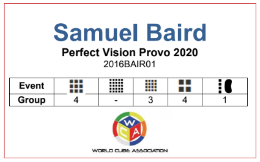

# Enhancing Competitor and Staff Experience

This is a guide to help organizers identify some quality of life items, resources, and small things they can do as organizers to enhance competitor, spectator, and staff experience at their competitions.

## Communication

### Badges/Lanyards:

Badges and lanyards can be used to give competitors group and staffing information in a way that makes it easy to access and understand.

::::: {.box .example}
An example lanyard from Perfect Vision Provo 2020 can be found below.
{.centered height=200px}
:::::

### Online resources:

Online resources can be used to benefit competitors, spectators, sponsors, and organizers! Here are a few online resources you can share with competitors and explanations of why they are beneficial:

- Sharing important competition information such as group information and staff assignments.
- Tutorials for events can help boost competitor numbers for those events.
- A sponsor’s homepage can increase revenue for your sponsor enabling them to better cover prize or venue cost.
- Travel information can help competitors and staff better plan their traveling routes and show them their options for lodging.

### Posters:

Posters can be used to give competitors and spectators information. Here are a few ways they can be used:

- Reminding people of things they should or should not do, ex. please stay quiet, do not use flash photography, stay 1.5 meters away from competitors.
- Label areas of importance, ex. competitor waiting area, quiet room, spectator seating.
- Convey group information and/or staff responsibilities to competitors by listing the information or by providing a link and/or QR code that directs them to the information online.

### Fliers:

Fliers can be used to convey important information about your competition to spectators and competitors, to answer some frequently asked questions that your local community may have, to alert competitions about future competitions in the area, and/or to direct competitors to online resources.

::::: {.box .example}
An example flier can be found [here](https://docs.google.com/document/d/1cjlvbTQ-e8_TzviEfQ_OUggNtEh-1R7GhKWMU-7IW28/edit?usp=sharing).
:::::

## Competitor Recognition

We highly recommend taking the efforts of recognizing competitors’ achievements and work by giving awards, prizes, or honors. Some achievements to qualify for awards, prizes, or honors could include achieving a podium in an event, achieving notable results, valuable staff contributions, the best sum of ranks/Kinch ranks at the competition, fastest new competitor, and participation.

Competitors should attend the winner's ceremony to receive awards/prizes/honors, the winner's ceremony should be held in the competition venue, within one hour after the end of the last event. Organizers should inform winners of awards, prizes, or honors to be prepared to talk to journalists or any media covering the competition if applicable. Organization teams of competitions should have certificates for all category winners, signed by the leader of the organization team, and by the WCA Delegate.

### Prizes:

Prizes are a great way to recognize competitors’ achievements. Sponsors should be sought out to help provide prizes, if possible. Some examples of prizes include puzzles, gift cards, cash, trophies, or medals. Prizes can also include an object or item related to the competition name ex. Potato Open 2018 offered potatoes for competitors who podiumed.

### Certificates:

Certificates are one of the least expensive ways to recognize competitors' achievements but can leave competitors with something to remember. It is recommended that you give competitors certificates even when you give prizes for the competition. You can find templates for certificates of volunteering, merit, and participation [here](https://drive.google.com/drive/folders/1jrMWgOgNscPDqoxzgnEQ1bnV9D4FDzLj).

## Venue Layout

### Stanchions:

Stanchions can be extremely helpful for crowd control! Some ways that you can use stanchions are to prevent people from coming within 1.5 meters of solving stations while they are in use, to separate the competition area from non-competition areas, and create a line for the registration table if your competition has one.

## For Fun

### Unofficial Events:

Holding events that aren’t recognized officially can be fun for competitors to participate in and spectators to watch. Some examples of unofficial events that could be held are team events, relays, and events that use non-WCA puzzles. This can also help the WCA in testing how these unofficial events may work in official settings in the future.

### Goodies:

Giving competitors “goodies” is a great way to enhance their competition experience! Examples of goodies that you could give to competitors can include but are not limited to: drawstring bags, T-shirts, hoodies, hats, bracelets, stickers, pins, keychains, lanyards, magnets, badges, pens, pencils, phone accessories, sunglasses, and cube logos. Goodies can include branding related to the competition, an organization that held the competition, or sponsors of the competition.

## Staff Rewards/Incentives

In order to incentivize competitors to join a dedicated staff, there are several things you can provide for free or a discounted price for them. This can include free or discounted registration fees, meals, apparel, or lodging. Staff incentives should be made known to the public in advance of the competition for transparency and to enroll a higher number of staff members.
